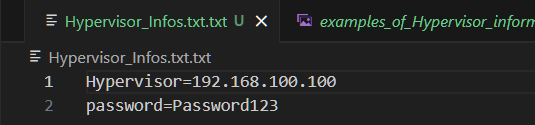
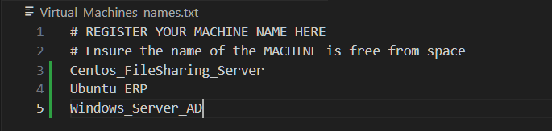

# Personal tool for performing automated Vms Backups

## Step 0 :
### Get sudo right and Create a directory :
            # We are giving default perm for child files of this directory :
    mkdir /Tools
    setfacl -m d:u:root:rwX Tools
    setfacl -m d:g:root:rwX Tools
    setfacl -m d:u:other:--- Tools 
    setfacl -m d:o:--- Tools

---
    After that, you need to clone this repository to your backup server.

## Step 1 : Installing ovftool on the backup Server
    
    You now need to install ovftool on that backup Server.

## Step 2 : Adding the ip address of the Hypervisor and the Password for root account :
    
    Delete everything in the file "Hypervisor_IP_address.txt".

    After that, add only the IP address of the hypervisor.

    The file should look like in the example bellow.

#### Examples of correct format for Hyperisor_Infos.txt

##### Abeg, choose a better password than that...

## Step 3 : Adding the Names of your vms to the files "Virtual_Machines_names.txt"
     
    Be sure to add the names of your vms to the file "Machines_names.txt" present in this repository.

#### Examples of correct format for Virtual_Machines_names.txt
---

    Please make sure that the VMs names have no space in it because the script won't work.

---

#### Examples of What won't work : :
>Windows server AD # This won't work

>Linux FTP Server  # This also won't work

#### Examples of What will work ::
>Windows_server_AD # This will work

>Linux_FTP_Server  # This will work
---
## This is the End

